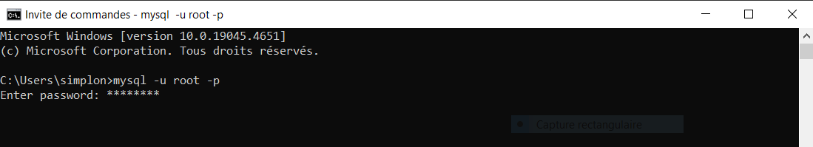
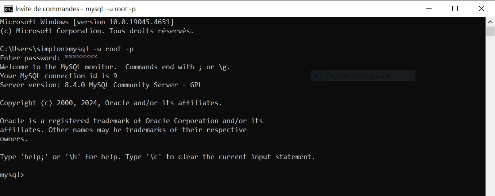
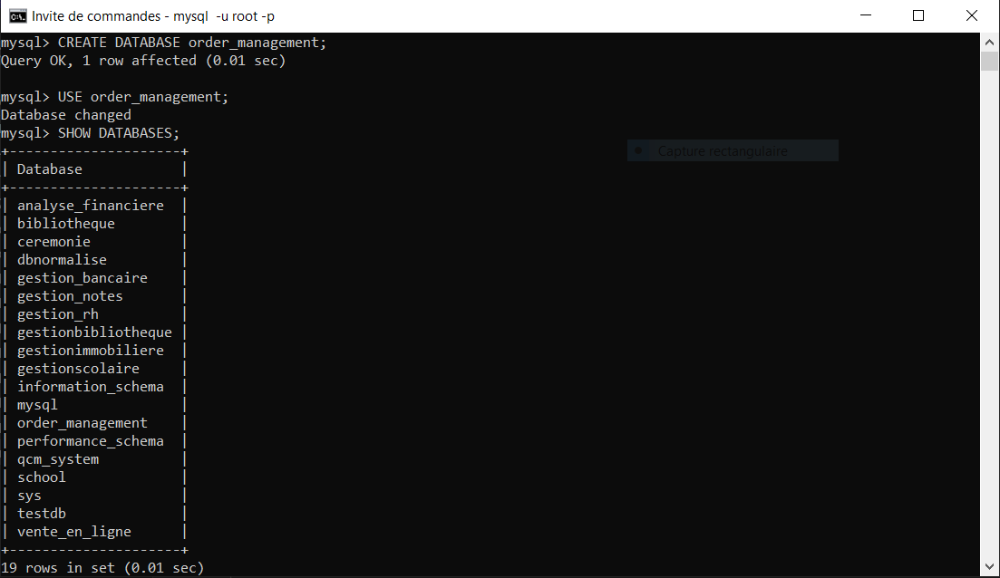
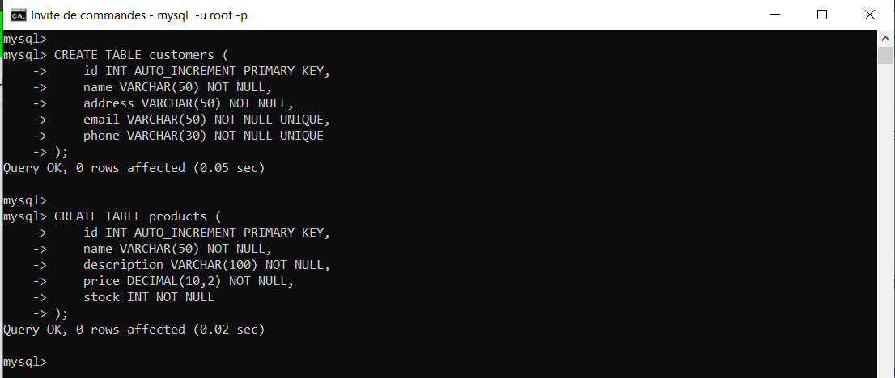
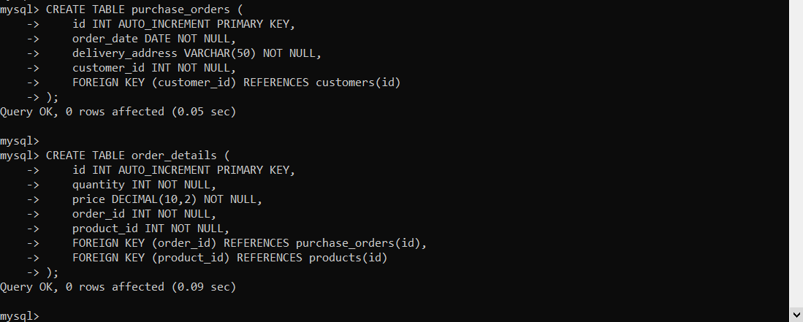
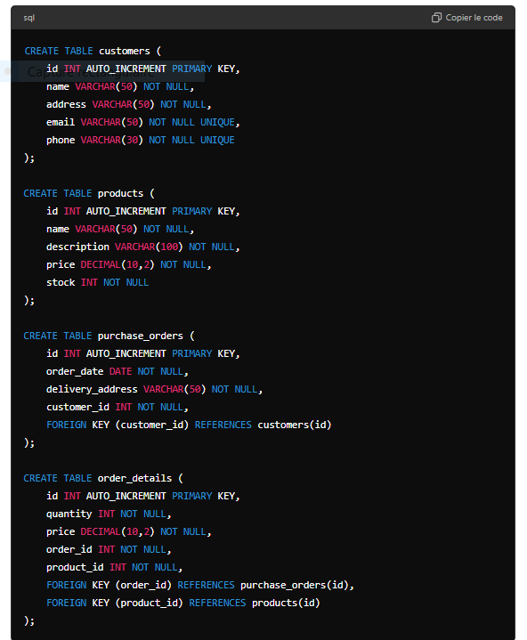

# Fichier readme.md
> Ceci un fichier
## Instructions d'Installation

### Étapes d'Installation

1. **Cloner ce repository :**
   ```bash
   git clone https://github.com/medbankole97/ABC-Corporation.git
   cd ABC-Corporation












# Fin de création de la base de données

